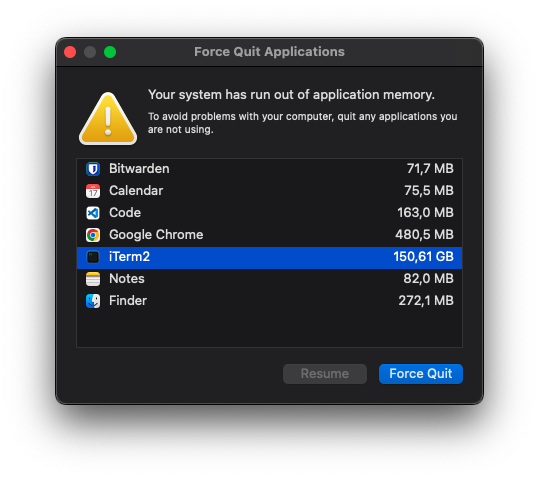

# MovCat
`cat` is for text files.
`imgcat` is for images.
And now `movcat` is for movies.

<p align="center">
    
</p>

# Limitations

- Only works on iTerm2
- Only works on macOS
- There is no audio
- There is no way to interact with the movie, e.g. pause, rewind, etc.
- Does not resize automatically, even though it is possible just not implemented yet
- Does not work with tmux (I mean, why would you want to use tmux with this?)
- Every 5 seconds the scrollback buffer is cleared, side effect being that the movie will flicker.
  - This is due to iTerm2's API not providing a way of clearing it, otherwise the scrollback buffer would increase indefinitely which quite fast will result in memory starvation. Like so:

<p align="center">
    
</p>


# Installation

- Clone the repository
- Install dependencies from `reuqirements.txt`
    - ```bash pip install -r requirements.txt```

# Usage

- After installation, you can run the script with
  - ```bash python movcat.py <path-to-movie-file>```

# License
MIT